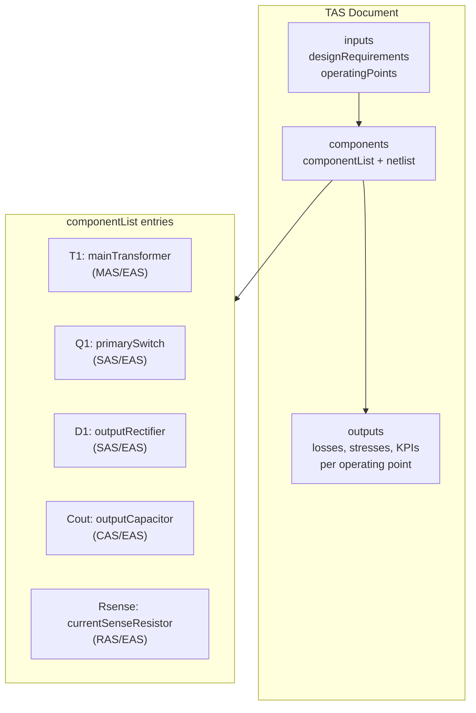
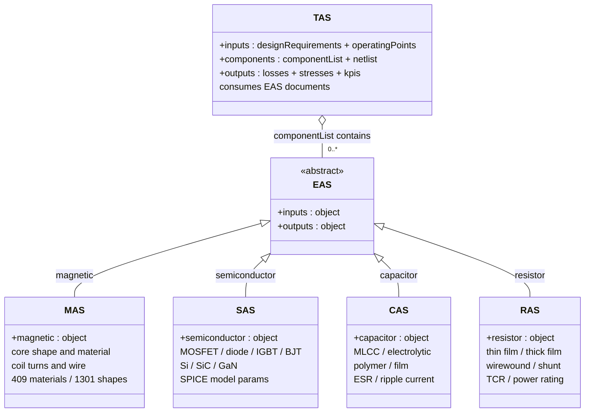
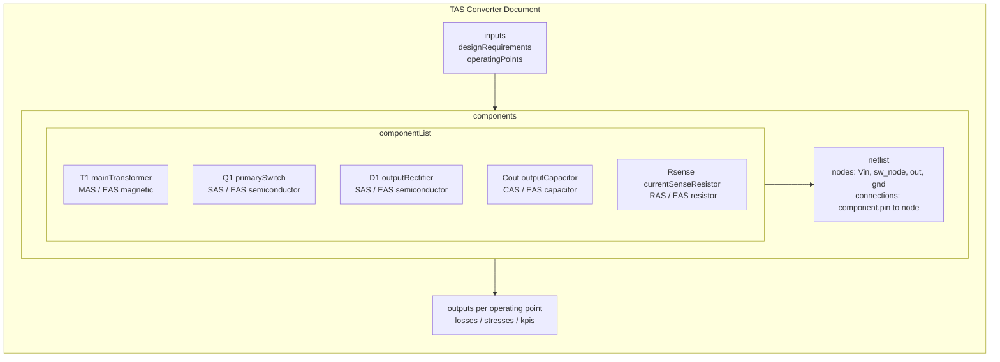
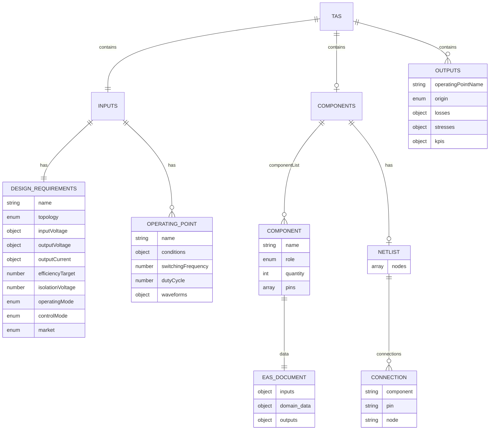
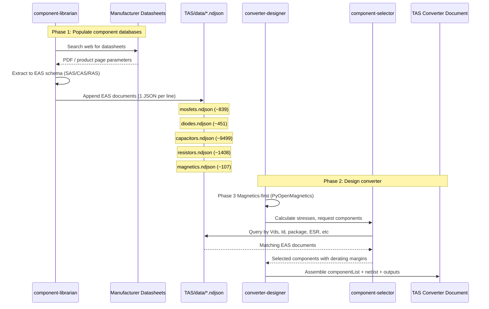
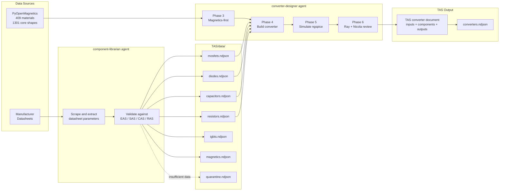
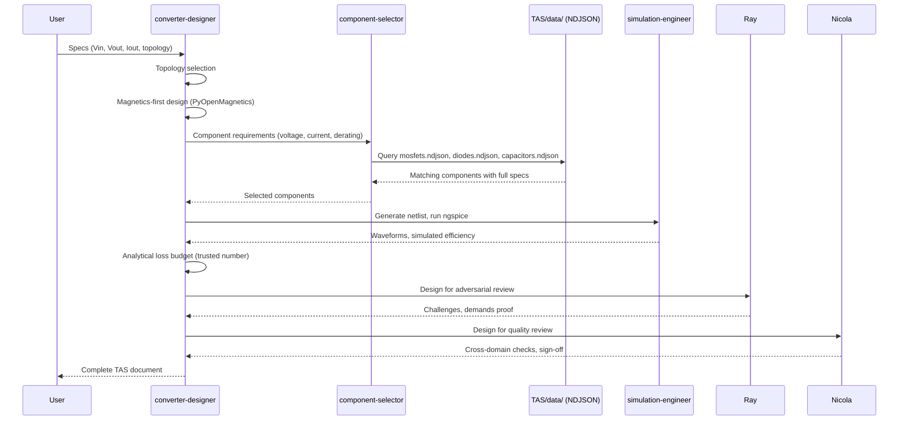

# TAS - Topology Agnostic Structure

*The universal data format for complete power converter designs*

---

## What is TAS?

TAS is a standardized JSON format that describes **complete power converter designs** -- from requirements through component selection to computed results. It also serves as the **component catalog** for the OpenConverters ecosystem, housing thousands of real-world MOSFETs, diodes, capacitors, resistors, magnetics, and IGBTs in NDJSON data files.

TAS has two distinct uses:

1. **Converter designs** -- A single TAS document captures everything about a converter: its electrical requirements, every component in the circuit (with full EAS data or references), the netlist showing how they connect, and the computed outputs (losses, stresses, efficiency) at each operating point.

2. **Component catalog** -- The `data/` directory contains NDJSON files with thousands of real components from manufacturers like EPC, Infineon, Vishay, Wurth, Nichicon, and others. Proteus agents query these files to select components during converter design.

### The Problem TAS Solves

A power converter design involves dozens of interrelated decisions: topology, switching frequency, magnetics, semiconductors, capacitors, control strategy. These decisions are typically scattered across spreadsheets, simulation files, datasheets, and emails. TAS captures the entire design in one machine-readable document:

```
+-------------------------------------------------------------+
|                        TAS Document                         |
+-------------------------------------------------------------+
|  INPUTS (What you need)                                     |
|  +-- Topology: Flyback Converter                            |
|  +-- Input voltage: 36-60 V                                 |
|  +-- Output: 12 V @ 2 A (24 W)                              |
|  +-- Efficiency target: 88%                                 |
|  +-- Operating points: Vin_min, Vin_nom, Vin_max            |
|                                                             |
|  COMPONENTS (What you build with)                           |
|  +-- T1: E25/13/7 N87 flyback transformer (MAS/EAS data)    |
|  +-- Q1: IPD65R420CFD 650V MOSFET (SAS/EAS data)            |
|  +-- D1: STPS8L40B Schottky rectifier (SAS/EAS data)        |
|  +-- Cout: 2x 220uF polymer caps (CAS/EAS data)             |
|  +-- Netlist: how all pins connect to circuit nodes          |
|                                                             |
|  OUTPUTS (What you get)                                     |
|  +-- Loss breakdown: core, winding, switch, diode, ...       |
|  +-- Stress analysis: voltage/current margins               |
|  +-- KPIs: 92% efficiency, 50 mV ripple                     |
+-------------------------------------------------------------+
```

---

## Architecture



TAS sits at the top of the OpenConverters schema hierarchy. It references EAS (Electronic Agnostic Structure) as the universal component container, which in turn wraps the domain-specific schemas:

```
                        +-------+
                        |  TAS  |  Complete converter design
                        +---+---+
                            |
              +-------------+-------------+
              |                           |
        inputs/outputs              components
        (converter-level)           (componentList + netlist)
                                        |
                                  Each component holds
                                  an EAS document:
                                        |
                        +-------+-------+-------+-------+
                        |       |       |       |       |
                       MAS     SAS     CAS     RAS    (EAS)
                    magnetics  semi-   capa-   resis-  universal
                    (cores,   conduc-  citors   tors   container
                     coils,   tors
                     wire)   (FETs,
                             diodes,
                             IGBTs)
```

### EAS Hierarchy (class diagram)

EAS is the abstract base. MAS, SAS, CAS, and RAS are the concrete implementations. TAS consumes them as component data within its componentList.



### Schema relationships

| Schema | Repository | Purpose | Analogy |
|--------|-----------|---------|---------|
| **MAS** | OpenMagnetics/MAS | Magnetic components: cores, coils, wire, materials | Building blocks for magnetics |
| **SAS** | OpenConverters/SAS | Semiconductors: MOSFETs, diodes, IGBTs, BJTs | Datasheet in JSON |
| **CAS** | OpenConverters/CAS | Capacitors: electrolytic, MLCC, film, polymer | Datasheet in JSON |
| **RAS** | OpenConverters/RAS | Resistors: shunt, thick film, thin film, wirewound | Datasheet in JSON |
| **EAS** | OpenConverters/EAS | Universal wrapper: `inputs` + one of {`magnetic`, `semiconductor`, `capacitor`, `resistor`} + `outputs` | Any component, one format |
| **TAS** | OpenConverters/TAS | Complete converter: `inputs` + `components` (list of EAS documents + netlist) + `outputs` | Full design document |

### Data files vs. schemas

The `data/*.ndjson` files are the **component catalog**. Each line is a standalone EAS-compatible document describing one real component. SAS, CAS, and RAS define the schemas; TAS stores the actual catalog data that Proteus agents search at design time.

### TAS Document Structure (flowchart)

A TAS converter document assembles EAS components into a circuit via a netlist:



### Schema Relationships (ER diagram)



### Component Selection Pipeline (sequence diagram)

Shows how the component-librarian populates databases and the converter-designer consumes them:



### Data Flow (end-to-end)



---

## Schema Reference

TAS consists of five schema files in `schemas/`:

### TAS.json -- Top-level document

The root schema. A TAS document has three optional sections (only `inputs` is required):

| Field | Type | Required | Description |
|-------|------|----------|-------------|
| `inputs` | object | Yes | Converter requirements and operating conditions. See `inputs.json`. |
| `components` | object | No | Components used in the converter. See `components.json`. |
| `outputs` | array of objects | No | Computed results per operating point. See `outputs.json`. |

### inputs.json -- Design requirements and operating points

#### designRequirements (required)

| Field | Type | Required | Description |
|-------|------|----------|-------------|
| `name` | string | No | Human-readable label for this design |
| `topology` | string (enum) | Yes | Converter topology (see enum below) |
| `inputVoltage` | dimensionWithTolerance | Yes | Input voltage range in Volts |
| `outputVoltage` | dimensionWithTolerance | Yes | Output voltage in Volts |
| `outputCurrent` | dimensionWithTolerance | No | Output current in Amperes |
| `outputPower` | dimensionWithTolerance | No | Output power in Watts |
| `efficiencyTarget` | number (0-1) | No | Target efficiency as fraction (e.g. 0.90 = 90%) |
| `isolationVoltage` | number or null | No | Required isolation voltage in Volts. Absent = non-isolated. |
| `operatingMode` | string (enum) | No | Preferred operating mode |
| `modulationType` | string (enum) | No | Modulation scheme |
| `controlMode` | string (enum) | No | Control loop architecture |
| `maximumDutyCycle` | number (0-1) | No | Maximum allowed duty cycle |
| `ambientTemperature` | dimensionWithTolerance | No | Ambient temperature range in Celsius |
| `market` | string (enum) | No | Target market segment |

**Topology enum values:**

- Buck Converter, Boost Converter, Buck-Boost Converter, Inverting Buck-Boost Converter
- SEPIC Converter, Cuk Converter, Zeta Converter
- Flyback Converter, Forward Converter, Two-Switch Forward Converter, Active Clamp Forward Converter
- Push-Pull Converter, Half-Bridge Converter, Full-Bridge Converter, Phase-Shifted Full-Bridge Converter
- LLC Resonant Converter, CLLC Resonant Converter, Dual Active Bridge
- Power Factor Correction Boost, Totem-Pole Bridgeless PFC

**operatingMode enum:** `CCM`, `DCM`, `BCM`, `CrCM`, `QR`

**modulationType enum:** `PWM`, `PFM`, `Hysteretic`, `Phase-Shift`

**controlMode enum:** `Voltage Mode`, `Peak Current Mode`, `Average Current Mode`, `COT`

**market enum:** `Consumer`, `Commercial`, `Industrial`, `Automotive`, `Medical`, `Military`, `Space`

#### operatingPoints (optional array, minItems: 1)

Each operating point describes a specific condition the converter must handle:

| Field | Type | Required | Description |
|-------|------|----------|-------------|
| `name` | string | Yes | Operating point name (e.g. "Full Load Vin_min") |
| `conditions` | object | No | Environmental conditions: `ambientTemperature`, `inputVoltage`, `outputCurrent` (all numbers) |
| `switchingFrequency` | number | No | Switching frequency in Hz |
| `dutyCycle` | number (0-1) | No | Duty cycle at this operating point |
| `operatingMode` | string (enum) | No | Actual operating mode at this point |
| `waveforms` | object | No | Signal waveforms keyed by name, each a `signalDescriptor` |

### components.json -- Component list and netlist

#### componentList (required array)

Each component in the array has:

| Field | Type | Required | Description |
|-------|------|----------|-------------|
| `name` | string | Yes | Reference designator (e.g. "T1", "Q1", "C1", "R1") |
| `role` | string (enum) | Yes | Circuit role of this component (see enum below) |
| `quantity` | integer (>= 1) | No | Number of identical units in parallel. Default: 1. |
| `pins` | array of strings | No | Pin names for netlist connections. If omitted, defaults are inferred from component type. |
| `data` | EAS document or string | Yes | Either a full inline EAS document, or a string path/URI to an external EAS file. |

**componentRole enum values:**

- **Inductors:** `mainInductor`, `resonantInductor`, `pfcInductor`, `filterInductor`
- **Transformers:** `mainTransformer`, `gateTransformer`, `currentTransformer`
- **Switches:** `highSideSwitch`, `lowSideSwitch`, `primarySwitch`, `secondarySwitch`, `clampSwitch`, `synchronousRectifier`, `pfcSwitch`
- **Diodes:** `outputRectifier`, `freewheelDiode`, `clampDiode`, `boostDiode`
- **Capacitors:** `inputCapacitor`, `outputCapacitor`, `bulkCapacitor`, `resonantCapacitor`, `bootstrapCapacitor`, `decouplingCapacitor`, `snubberCapacitor`, `clampCapacitor`
- **Resistors:** `currentSenseResistor`, `gateResistor`, `feedbackResistor`, `bleederResistor`, `snubberResistor`, `clampResistor`

#### netlist (optional)

Defines how components are wired together:

| Field | Type | Required | Description |
|-------|------|----------|-------------|
| `nodes` | array of strings | Yes | Named electrical nodes (e.g. "Vin", "sw_node", "out", "gnd") |
| `connections` | array of connection objects | Yes | Each connection maps one component pin to one node |

Each **connection** has:

| Field | Type | Required | Description |
|-------|------|----------|-------------|
| `component` | string | Yes | Reference designator (must match a name in componentList) |
| `pin` | string | Yes | Pin name (e.g. "drain", "source", "anode", "cathode", "dot", "positive") |
| `node` | string | Yes | Circuit node this pin connects to (must be in nodes list) |

### outputs.json -- Computed results per operating point

Each output object corresponds to one operating point:

| Field | Type | Required | Description |
|-------|------|----------|-------------|
| `operatingPointName` | string | No | Which operating point these results correspond to |
| `origin` | string (enum) | No | How results were obtained: `simulation`, `measurement`, or `analytical` |
| `methodUsed` | string | No | Specific tool or method (e.g. "Proteus converter-designer", "ngspice", "bench measurement") |
| `losses` | lossBreakdown | No | Complete loss budget |
| `stresses` | stressAnalysis | No | Component stress margins |
| `kpis` | kpis | No | Key performance indicators |
| `waveforms` | object | No | Result waveforms keyed by signal name |

#### lossBreakdown

All fields are optional, type `number`, in Watts:

| Field | Description |
|-------|-------------|
| `coreLosses` | Magnetic core losses |
| `windingLosses` | Magnetic winding losses |
| `switchConduction` | MOSFET/IGBT conduction losses |
| `switchSwitching` | Turn-on + turn-off overlap losses |
| `switchCoss` | Output capacitance (Coss) charging losses |
| `gateDrive` | Gate drive losses (Qg x Vgs x fsw) |
| `diodeConduction` | Diode forward voltage losses |
| `diodeReverseRecovery` | Diode Qrr losses |
| `capacitorEsr` | Capacitor ESR losses |
| `clamp` | RCD/active clamp losses |
| `snubber` | Snubber losses |
| `controller` | Controller quiescent power |
| `other` | Other losses |
| `total` | Sum of all losses |

#### stressAnalysis

All fields are optional, type `number`:

| Field | Description |
|-------|-------------|
| `switchVoltageMax` | Maximum switch voltage (V) |
| `switchVoltageRating` | Switch voltage rating (V) |
| `switchVoltageMargin` | Fraction (e.g. 0.25 = 25% margin) |
| `diodeVoltageMax` | Maximum diode reverse voltage (V) |
| `diodeVoltageRating` | Diode voltage rating (V) |
| `diodeVoltageMargin` | Fraction |
| `capacitorVoltageMax` | Maximum capacitor voltage (V) |
| `capacitorVoltageRating` | Capacitor voltage rating (V) |
| `capacitorVoltageMargin` | Fraction |
| `inductorCurrentMax` | Peak inductor current (A) |
| `inductorSaturationCurrent` | Inductor saturation current (A) |
| `inductorCurrentMargin` | Fraction |
| `maxJunctionTemperature` | Hottest junction temperature (C) |
| `junctionTemperatureRating` | Junction temperature rating (C) |
| `thermalMargin` | Fraction |

#### kpis

| Field | Type | Description |
|-------|------|-------------|
| `efficiency` | number | Pout / Pin (0-1) |
| `outputRipple` | number | Output voltage ripple peak-to-peak (V) |
| `inputPower` | number | Input power (W) |
| `outputPower` | number | Output power (W) |
| `powerDensity` | number or null | W/cm^3 |
| `cost` | number or null | Estimated BOM cost (USD) |

### utils.json -- Shared definitions

#### dimensionWithTolerance

Specifies a value with optional min/nom/max. At least one of the three must be present.

```json
{ "minimum": 36.0, "nominal": 48.0, "maximum": 60.0 }
```

#### signalDescriptor

A time-domain signal description (MAS-compatible). Must have either `waveform` (raw data) or `processed` (parameterized).

**waveform** (raw time-domain data):

| Field | Type | Required | Description |
|-------|------|----------|-------------|
| `data` | number[] | Yes | Amplitude values |
| `time` | number[] | Yes | Time values |
| `numberPeriods` | integer | No | Number of periods in the data (default: 1) |

**processed** (parameterized waveform):

| Field | Type | Required | Description |
|-------|------|----------|-------------|
| `label` | string (enum) | No | Waveform shape: Triangular, Sinusoidal, Rectangular, Custom, Unipolar Rectangular, Bipolar Rectangular, Flyback Primary, Flyback Secondary, Forward Primary, Forward Secondary |
| `dutyCycle` | number (0-1) | No | Duty cycle |
| `peakToPeak` | number | No | Peak-to-peak amplitude |
| `peak` | number | No | Peak value |
| `offset` | number | No | DC offset |
| `average` | number | No | Average value |
| `rms` | number | No | RMS value |
| `effectiveFrequency` | number | No | Effective frequency in Hz |

#### curve

X-Y data points:

| Field | Type | Description |
|-------|------|-------------|
| `xData` | number[] | X-axis values |
| `yData` | number[] | Y-axis values |

---

## Data Files

The `data/` directory contains NDJSON (Newline-Delimited JSON) files. Each line is one JSON object representing a single component. Line 1 of each file is a comment indicating the total record count.

| File | Records | Description |
|------|---------|-------------|
| `mosfets.ndjson` | ~839 | Si and GaN MOSFETs. Each record is an EAS document with `inputs`, `semiconductor`, and `outputs`. Includes EPC eGaN, Infineon CoolMOS, and others. Fields cover Vds, Id, Rds(on), Qg, Coss, thermal resistances, SPICE model parameters. |
| `diodes.ndjson` | ~451 | Schottky, ultrafast, SiC diodes. Fields cover reverse voltage, forward current/voltage, junction capacitance, Qrr, SPICE model parameters, thermal data. |
| `capacitors.ndjson` | ~9,499 | Aluminum electrolytic, polymer, MLCC, film capacitors. Includes Nichicon, Panasonic, TDK, and others. Fields cover capacitance, voltage rating, ESR, ripple current (with frequency multipliers), dissipation factor, lifetime data. |
| `resistors.ndjson` | ~1,408 | Current sense shunts, thick/thin film, metal foil, wirewound resistors. Fields cover resistance, tolerance, TCR, power rating, dimensions, SPICE parameters. |
| `magnetics.ndjson` | ~107 | Off-the-shelf power inductors (Wurth WE-MAPI, Coilcraft, etc.). Each is a full MAS-compatible document with core, coil, and commercial specs (inductance, DCR, saturation current, rated current). |
| `igbts.ndjson` | ~11 | IGBT modules from Fuji Electric, Infineon, etc. Fields cover Vce, Ic, Eon/Eoff, Vce(sat), Foster thermal networks. |
| `quarantine.ndjson` | ~82 | Components that do not fit current schemas (e.g. controller ICs like UCC28740, LTC3310S). Stored with a `reason` field explaining why they are quarantined. Intended for future schema expansion. |
| `converters.ndjson` | 0 | Placeholder for complete converter designs stored as TAS documents. Currently empty. |

### Backup files

Files with `.bak` and `_pre_excel` suffixes are backups and are not used at runtime.

---

## Examples

### Example 1: Flyback 48V to 12V @ 2A (isolated)

File: `examples/01_flyback_48v_to_12v.json`

This is a complete TAS document for a 24W isolated flyback converter with peak current mode control.

**Inputs section:**
- Topology: Flyback Converter, 36-60V input, 12V output, 2A
- 1500V isolation, 88% efficiency target, CCM operation, peak current mode
- Three operating points defined: Full Load at Vin_nom (48V, D=0.35), Vin_min (36V, D=0.45), and Vin_max (60V, D=0.27)

**Components section** (6 components with full EAS data inline):
- **T1** (mainTransformer): E 25/13/7 core, N87 ferrite, 0.5mm gap. Primary: 28 turns Litz 20x0.1mm. Secondary: 7 turns, 2 parallels of Litz 40x0.1mm. Turns ratio 4:1. Magnetizing inductance 200 uH. Includes computed core losses (0.35W) and winding losses (0.45W).
- **Q1** (primarySwitch): Infineon IPD65R420CFD, 650V/5.5A Si MOSFET, Rds(on)=0.42 Ohm, Qg=9.3nC, TO-252.
- **D1** (outputRectifier): STMicroelectronics STPS8L40B, 40V/8A Schottky, Vf=0.5V, D-PAK.
- **Cout** (outputCapacitor, quantity: 2): 220uF/25V polymer electrolytic, ESR=15 mOhm.
- **Cin** (inputCapacitor): 100uF/100V aluminum electrolytic, ESR=50 mOhm.
- **Rsense** (currentSenseResistor): 0.5 Ohm, 1% tolerance, 0.25W.

**Netlist:** 8 nodes (Vin, sw_node, pri_gnd, sec_dot_node, out, sec_gnd, gate_drive, sense_node) with 14 connections defining the complete flyback circuit.

**Outputs** (one operating point computed):
- Total losses: 2.10W (core 0.35W, winding 0.45W, switch conduction 0.12W, switch switching 0.40W, diode 0.60W, clamp 0.10W)
- Efficiency: 92.0%
- Switch voltage margin: 75% (160V max on 650V FET)
- Output ripple: 50 mV

### Example 2: Buck 12V to 5V @ 3A (non-isolated)

File: `examples/02_buck_12v_to_5v.json`

A simpler 15W non-isolated buck converter with voltage mode control at 500 kHz.

**Inputs section:**
- Topology: Buck Converter, 10-14V input, 5V output, 3A
- 92% efficiency target, CCM, PWM, voltage mode
- One operating point with waveforms: triangular inductor current (0.6A p-p, 3A offset) and rectangular switch voltage

**Components section** (uses a simpler summary format, not full EAS inline):
- **L1** (mainInductor): Coilcraft XAL5030, 22uH metal composite, 0.12W winding + 0.05W core losses
- **Q1** (highSideSwitch): BSC010N04LS, 40V/100A Si MOSFET, Rds(on)=1 mOhm, Qg=48nC
- **D1** (freewheelDiode): SS34, 40V/3A Schottky, Vf=0.5V
- **Cout** (outputCapacitor, quantity: 3): 22uF/10V MLCC X5R, ESR=3 mOhm

**Outputs:**
- Total losses: 0.59W
- Efficiency: 96.2%
- Switch voltage margin: 65% (14V max on 40V FET)
- Output ripple: 20 mV



---

## How to Use

### Querying the component catalog

The NDJSON files are designed for line-by-line searching. Each line is a self-contained JSON object, so agents can search for components using `grep` or programmatic JSON parsing.

**Find all GaN MOSFETs rated above 100V:**

```bash
grep '"technology":"GaN"' data/mosfets.ndjson | \
  python3 -c "
import sys, json
for line in sys.stdin:
    if line.startswith('//'): continue
    d = json.loads(line)
    info = d.get('semiconductor',{}).get('manufacturerInfo',{}).get('datasheetInfo',{})
    vds = info.get('electrical',{}).get('drainSourceVoltage',0)
    if vds > 100:
        pn = info.get('part',{}).get('partNumber','?')
        rds = info.get('electrical',{}).get('onResistance','?')
        print(f'{pn:20s} {vds}V  Rds={rds} Ohm')
"
```

**Find low-ESR capacitors for a 12V output:**

```bash
python3 -c "
import json
with open('data/capacitors.ndjson') as f:
    for line in f:
        if line.startswith('//'): continue
        d = json.loads(line)
        info = d.get('manufacturerInfo',{}).get('datasheetInfo',{})
        e = info.get('electrical',{})
        cap = e.get('capacitance',{})
        c = cap.get('nominal',0) if isinstance(cap, dict) else cap
        v = e.get('ratedVoltage',0)
        esr = e.get('esr', 999)
        if v >= 16 and c >= 22e-6 and esr < 0.01:
            pn = info.get('part',{}).get('partNumber','?')
            print(f'{pn:25s} {c*1e6:.0f}uF {v}V ESR={esr*1000:.1f}mOhm')
"
```

### Creating a converter design

1. Start with `inputs.designRequirements` -- define topology, voltages, current, efficiency target.
2. Add `inputs.operatingPoints` -- at minimum, full load at Vin_min, Vin_nom, and Vin_max.
3. Select components from the catalog and add them to `components.componentList`. Each component gets a reference designator, a role, and its EAS data (either inline or as a reference path).
4. Define the `components.netlist` showing how pins connect to circuit nodes.
5. Run analysis (analytical, simulation, or measurement) and record results in `outputs`.

### Referencing components

Component data follows the EAS pattern. You can either embed the full document inline:

```json
{
    "name": "Q1",
    "role": "primarySwitch",
    "data": {
        "inputs": { "designRequirements": {} },
        "semiconductor": { "manufacturerInfo": { "..." : "..." } },
        "outputs": {}
    }
}
```

Or use a string reference to an external file:

```json
{
    "name": "Q1",
    "role": "primarySwitch",
    "data": "data/mosfets/IPD65R420CFD.json"
}
```

---

## Contributing

### Adding new components

1. Identify the correct data file (`mosfets.ndjson`, `diodes.ndjson`, `capacitors.ndjson`, `resistors.ndjson`, `magnetics.ndjson`, or `igbts.ndjson`).
2. Create a JSON object following the EAS/SAS/CAS/RAS schema for that component type.
3. Include all available datasheet data: electrical parameters, thermal data, mechanical dimensions, SPICE model parameters if available.
4. Append the JSON object as a single line to the appropriate NDJSON file.
5. If the component does not fit any existing schema (e.g. controller ICs, gate drivers), add it to `quarantine.ndjson` with a `reason` field explaining why.

### Adding new converter examples

1. Create a new JSON file in `examples/` following the TAS schema.
2. Name it with a sequential number and descriptive name: `03_llc_400v_to_12v.json`.
3. Include all three sections: `inputs`, `components`, and `outputs`.
4. Define at least three operating points (Vin_min, Vin_nom, Vin_max at full load).
5. Provide a complete loss breakdown and stress analysis in the outputs.

### Schema changes

All schemas use JSON Schema 2020-12. When modifying schemas:

- Maintain backward compatibility -- add new optional fields rather than changing existing ones.
- Update `utils.json` for shared definitions used across multiple schemas.
- Ensure enum values stay consistent with MAS (e.g. topology names, waveform labels).

---

## License

MIT
